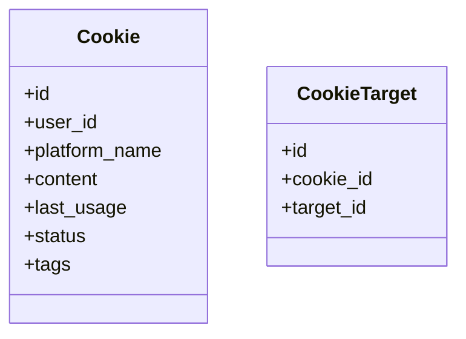
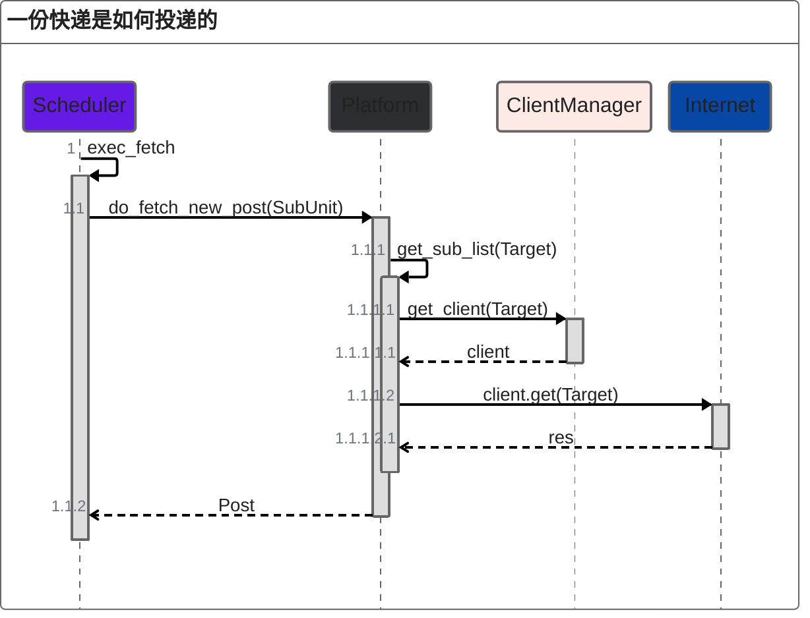
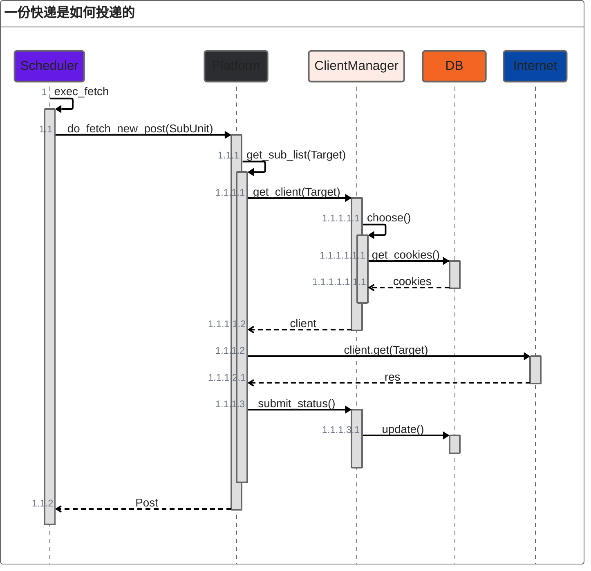

# Cookie 组件设计

## 总体需求

允许用户上传Cookie，请求时使用用户的Cookie以访问受限的内容。

## 目标

尽量不要触发风控；绝对不要触发造成封号或者需要人工介入解风控的操作。
在以上基础上，以尽可能高的频率抓取信息。

## 总体设计

由于不同用户的订阅目标往往有很大的重合，所以采用Cookie池化方案。

**Cookie池化**：所有用户上传的Cookie构成一个池，每次请求从池中选择一个合适的进行请求。

* **数据库模块**：用户上传的Cookie需要持久化
* **Cookie调度模块**：选择合适的Cookie
* **用户交互模块**：提供用户上传Cookie的方式
  * 对话：用户可以使用传统的和bot对话的方式添加
  * Web控制面板：用户可以使用Web控制面板上传cookie

## 详细设计

### 数据库模块

Cookie数据特点：
* Cookie由用户上传，且具有私密性
* 一个Cookie只能适配一个站点
* 一个Cookie可以访问多个受限的内容

因此，Cookie应该依附于用户和站点，并支持手动选择此Cookie支持哪一些站点。同时，还需要保存Cookie的状态，所以添加last_usage和status字段，分别表示上次使用的时间和响应的状态。

### Cookie调度器

目前的抓取的流程：

考虑到项目已有的结构和实现难度，目前的方向是在原先的选择Target操作之后，再根据Target再选择一个合适的Cookie。

具体为在ClientManager内嵌选择Cookie的算法，当请求Client时，根据传入的Target信息和所有Cookie的状态，选择一个最合适的Cookie，组装成Client再返回给Platform。

同时，因为需要存储每一次请求的状态（是否请求成功，有没有被风控），所以还要及时更新Cookie的状态信息。考虑使用 hook Client或者代理 Client 或者 Platform 手动提交实现

### 用户交互

根据Cookie的设计，交互方面需要支持以下操作：

* 为某一个Platform上传Cookie
* 将某一个Cookie分配给一个Target

用户的使用流程将会是（以weibo平台举例）：

* 添加一个weibo平台的订阅
* 给weibo平台上传一个用户Cookie
* 给订阅的对象，分配刚刚上传的Cookie

这样，bison就可以正确识别，将会使用用户上传的Cookie去请求订阅目标

## Cookie 选择算法

### 需求

* 需要同时考虑到实名Cookie和匿名Cookie的情况
* 需要为后续自定义策略预留可定制空间

### 思路

* 匿名Cookie可以视为可以获取所有用户的基本信息的「特殊的实名Cookie」，可以整合进实名Cookie的调度中
* 数据库表设计last_usage和status字段，分别表示上次使用的时间和响应的状态。
* 数据库表设计tags字段，类型为json格式的dict，为后续拓展留空间

### 一种基于优先队列的Cookie选择算法

只是简单的选择。

设定：

* Cookie的「空闲时间」定义为从上次被选择到现在，经过的时间
* 每一个Cookie有一个独立的CD，每次使用之后必须间隔一定时间后才能够再次使用
* 匿名Cookie作为保底，设置比实名Cookie短的CD

实现思路

* 在每次Cookie被选择时，记录此时的时间
* 每次选择时，选择空闲时间最长的Cookie，并检查是否过了CD，如果还在冷却，则选择下一个Cookie，否则选择该Cookie
* 如果没有可用的Cookie，则跳过本次选择

# 注意事项

由于用户cookie获取到的内容能可能会被其他用户共享，所以需要声明，使用前说明清楚 不同意别用

