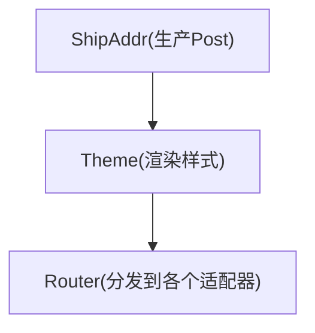
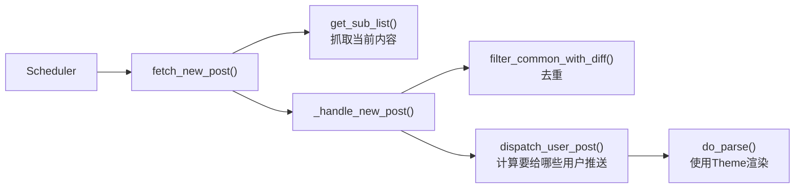
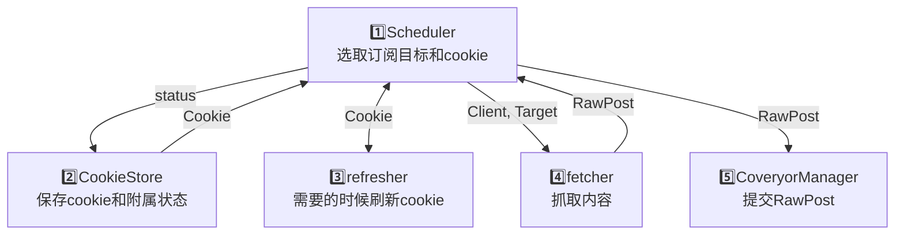
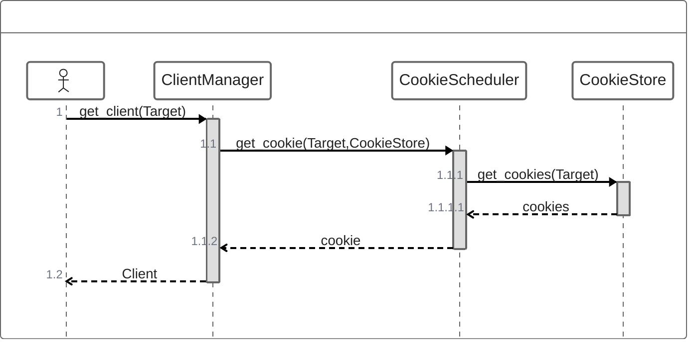

nonebot 插件学习项目

参考官方文档：https://nonebot.dev/docs/tutorial/application

同时是参与 OSPP 2024 MountainDash 社区的 nonebot-bison 项目的试验 repo

# cookie 方案

## 目标

原则：尽量不要触发风控；绝对不要触发造成封号或者需要人工介入解风控的操作
在以上基础上，以尽可能高的频率抓取信息

## 多租户隔离

一个订阅使用特定的 cookie，不同订阅之间相互隔离

## 池化

这个是项目的关键点。

定义：

* 一次检查：检查内容是否有更新
* 一次请求：发出一次网络请求

我关于这个问题的推演

### 一对一

先从一个用户一个订阅说起，此时为一对一关系，有更新就推送。

### 多对一

其次是一个用户多个订阅，此时为多对一关系，也是有更新就推送。

### 一对多

再接着是多个用户一个订阅，此时为一对多关系。注意，此时不需要按照每个用户都去请求一次，因为订阅的 target 是同一个，所以获取到的内容也是一样的，所以一次检查只需要请求一次。

### 多对多

最后是多个用户多个订阅，这个产生了问题，用户的订阅列表可以和其他用户不一样。也就是就说，不同的订阅列表之间存在交集和差集。但是，如果只考虑一个用户，那还是多对一关系。反过来，如果只考虑一个订阅，那还是一对多关系，所以同上。

所以，一个订阅一次检测请求一次，内容有更新，就推送给所有已订阅该 target 的用户。

## Cookie

这个时候再引入 cookie

前提：获取订阅消息需要 cookie，用户让 bot 托管 cookie，代向平台请求

### 一对多

直接从多个用户一个订阅开始

首先，因为请求需要 cookie，所以先只有上传了 cookie 的用户可以使用。按照上面的思路，一对多关系一次检查请求一次，而我手上有很多用户的 cookie，所以我可以对 cookie 使用轮序策略，减少被风控的可能。

但是，既然我们 bot 可以获得信息，而复制信息又没有额外的花费，所以我们其实也可以把订阅到的信息发送给没有上传 cookie 的用户。

所以，最终是。用户集合中部分用户上传 cookie，形成 cookie 池，每次请求从 cookie 池中选择后进行请求，当检测到内容有更新时发送给所有已订阅用户。

### 多对多

问题逐渐棘手起来了

可以按照前面的思路，对每一个 target 进行分析，就还是一对多关系，同时对每一个 target 建立一个 cookie 池，每次请求从对应 target 的 cookie 池中选择 cookie 进行请求。

这里要注意到，同一个 cookie 可以请求到不同的受限信息，比如说我可以关注很多仅粉丝可见的人，这就又形成了一个多对一关系。

那这样子，cookie 不能够绑定在 target 上，而是应该绑定在用户上，然后让用户选择该 cookie 支持哪一些 target。

但是不同的用户的关注列表是有差别的，所以不同 cookie 支持访问的不同 target 还是不一样的，而我们又允许用户不上传 cookie 就可以订阅某些受限的 target。所以 cookie 支持的 target 是用户订阅的 target 的一个子集。

### 问题

那么，假象一个由多个用户和多个 target 组成的多对多场景，在其他量不变的情况下，我的某一个 cookie 支持的 target 越多，是不是意味着我这个 cookie 被选择去进行请求的概率就越大。

而请求越多，受到风控的可能也越大。

所以，还需要有一个策略来平衡不同 cookie 之间的使用频率。

## 方案

### 方案一

定义 cookie 的空闲时间为该 cookie 上一次请求到现在经过的时间

设置一个最小请求间隔阈值

贪心策略，对于每个 target 每次检查时，选择空闲时间最长的 cookie 进行请求，如果空闲时间仍小于最小请求间隔，则跳过请求。

如果每一个 target 的请求间隔相同，必然会产生对于一些仅有一两个由“大”cookie 所支持的 target 的饥饿现象

## Conveyor && Parcel

参考 issue：https://github.com/MountainDash/nonebot-bison/issues/478

个人理解：使用消息队列，使得各个模块解耦

目前的控制流程全部在 scheduler 内实现，使得各个组件耦合度高

想法是

一篇文章从获取到发送的的大致流程：

同时，把调度也做成接口，提供几个默认的调度策略。

# Bison 加载流程
* bison/__init__
  * 导入 post, send, theme, types, utils, config, platform
  * 导入 bootstrap
    * 注册数据库迁移脚本
  * 导入 admin_page
    * 向 fastapi 注册 route
  * 导入 sub_manager
    * 向 nonebot 注册 Matcher

# Bison 运行流程
* bootstrap.pre 数据库迁移
  * config_legacy 加载旧的配置文件
  * data_migrate 数据迁移
* init_scheduler 初始化调度器
  * db_config.get_platform_target 获取平台信息
  * scheduler.__init__ 调度器初始化
    * 初始化各个平台

* 调度循环
  * exec_fetch 抓取任务
  * get_next_schedulable 根据权重，获取下一个可执行的任务
  * 如果获取到任务
    * platform.do_fetch_new_post 
      * platform.catch_network_error 网络错误的 utils
        * platform.fetch_new_post 抓取并去重
          * weibo.get_sub_list ~~获取订阅列表~~获取当前 target 的所有内容
          * weibo._handle_new_post 
            * NewMessage.filter_common_with_diff 使用内部缓存的 post 进行去重
            * 如果有新内容：dispatch_user_post

# 发消息流程
* exec_fetch
  * ...
    * dispatch_user_post: 根据消息类型和用户的订阅类型，计算要给哪一些用户发消息
      * do_parse -> parse: Platform 内部逻辑，把 RawPost 转换成 Post
  * send_post.generate_messages()
    * self.generate()
      * get_priority_themes: theme
        * theme.do_render() -> render(): theme把 Post 转换成 MessageSegmentFactory
    * message_segments_process, message_process: 对MessageSegmentFactory做一些处理
    * send_msgs(): 使用saa发送MessageSegmentFactory

# 几个理解
* 存在「Target 集合」和「userinfo 集合」，两者职责上面分离，前者只负责抓取，抓下来了之后，再由后者判断要给哪一些 user 推送
* 每个站点有自己的scheduler、ProcessContext、ClientManager等，站点之间互相独立，互不干扰。但是共用推送的渠道（bot）

# 全局工具类
* DBConfig: 数据库相关，增删差改订阅信息的接口
* ProcessContext: 获取 AsyncClient 的统一入口，返回 hook 过的 AsyncClient
* ClientManager:  AsyncClientFactory，~~（怎么有这么多获取Client的方法，看不出来有什么区别😵‍💫）~~
* Site: 调度器直接调度的对象？ ~~（和Platform有什么区别😵‍💫😵‍💫😵‍💫）~~
* PlugConfig: 在nonebot框架下，插件的配置信息类
* send.py: 所有MessageFactory的归宿，全局推送限流

# 当前实现分析与改进想法

## 当前的主要抓取逻辑

## 加入Cookie
先不考虑当前实现如何引入的问题，单独考虑对抓取逻辑的影响。

### 风控策略
首先，先预设平台可能的风控策略：
* 请求速率限制（对ip，对用户），可能有分级
* UA/Cookie 等基本参数校验
* 行为分析，比如是否高频访问同一个页面

### 策略分析 & 调度目标
* 对于 UA/Cookie 和行为分析，这里不考虑，因为我们的目标是尽量不触发风控，所以我们假设我们的 cookie 是合法的，我们的行为是合法的。
* 请求速率限制：对于ip的限制，由于项目当前没有使用多ip的能力，这里不考虑ip的问题。对于用户的限制，我们可以朴素地认为，对于每个用户，当请求速率超过一定阈值时，才会被风控。所以，我们的目标是，在平台速率的限制下，尽量高频率地抓取信息。

### 构想的一种实现思路
主要思路：将 cookie 选择和 Target 调度整合在 Scheduler 中，Scheduler 基于当前的 Target 和 cookie 集合的状态，选择最合适的cookie进行请求，类似于状态机。请求后更新cookie的状态。请求得到的 RawPost 递交 ConveyorManager，由后续步骤处理。

## 引入的新组件
* CookieStore: 保存 cookie 和 cookie 的状态。
* CookieScheduler: 选择最合适的 cookie。

### 一种简单的做法
修改 ClientManager，内部添加对添加对 CookieStore 和 CookieScheduler 的引用。修改原先的 get_client(Target)方法，方法内部通过 CookieScheduler 和 CookieStore 选择最合适的 cookie，装载到 Client 中并返回。

优点：简单，不需要修改原有的调度逻辑，侵入性小。

缺点：本质上是先选定 Target，再选择 Cookie，这样的话，可能难以得到全局最优解。

# CoveryorManager
* 单例模式
* 对外暴露一个方法：提交 Parcel 到队列
* 一个装饰器，用于注册 Parcel 的处理函数
* 内部一条队列，用 Memory object streams 实现

被毙了，瘫

