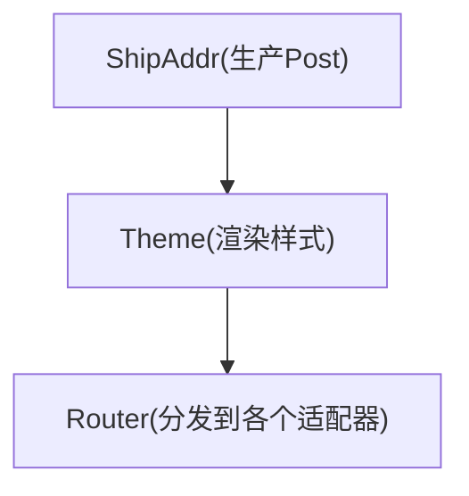

nonebot 插件学习项目

参考官方文档：https://nonebot.dev/docs/tutorial/application

同时是参与 OSPP 2024 MountainDash 社区的 nonebot-bison 项目的试验 repo

# cookie 方案

## 目标

原则：尽量不要触发风控；绝对不要触发造成封号或者需要人工介入解风控的操作
在以上基础上，以尽可能高的频率抓取信息

## 多租户隔离

一个订阅使用特定的 cookie，不同订阅之间相互隔离

## 池化

这个是项目的关键点。

定义：

* 一次检查：检查内容是否有更新
* 一次请求：发出一次网络请求

我关于这个问题的推演

### 一对一

先从一个用户一个订阅说起，此时为一对一关系，有更新就推送。

### 多对一

其次是一个用户多个订阅，此时为多对一关系，也是有更新就推送。

### 一对多

再接着是多个用户一个订阅，此时为一对多关系。注意，此时不需要按照每个用户都去请求一次，因为订阅的 target 是同一个，所以获取到的内容也是一样的，所以一次检查只需要请求一次。

### 多对多

最后是多个用户多个订阅，这个产生了问题，用户的订阅列表可以和其他用户不一样。也就是就说，不同的订阅列表之间存在交集和差集。但是，如果只考虑一个用户，那还是多对一关系。反过来，如果只考虑一个订阅，那还是一对多关系，所以同上。

所以，一个订阅一次检测请求一次，内容有更新，就推送给所有已订阅该 target 的用户。

## Cookie

这个时候再引入 cookie

前提：获取订阅消息需要 cookie，用户让 bot 托管 cookie，代向平台请求

### 一对多

直接从多个用户一个订阅开始

首先，因为请求需要 cookie，所以先只有上传了 cookie 的用户可以使用。按照上面的思路，一对多关系一次检查请求一次，而我手上有很多用户的 cookie，所以我可以对 cookie 使用轮序策略，减少被风控的可能。

但是，既然我们 bot 可以获得信息，而复制信息又没有额外的花费，所以我们其实也可以把订阅到的信息发送给没有上传 cookie 的用户。

所以，最终是。用户集合中部分用户上传 cookie，形成 cookie 池，每次请求从 cookie 池中选择后进行请求，当检测到内容有更新时发送给所有已订阅用户。

### 多对多

问题逐渐棘手起来了

可以按照前面的思路，对每一个 target 进行分析，就还是一对多关系，同时对每一个 target 建立一个 cookie 池，每次请求从对应 target 的 cookie 池中选择 cookie 进行请求。

这里要注意到，同一个 cookie 可以请求到不同的受限信息，比如说我可以关注很多仅粉丝可见的人，这就又形成了一个多对一关系。

那这样子，cookie 不能够绑定在 target 上，而是应该绑定在用户上，然后让用户选择该 cookie 支持哪一些 target。

但是不同的用户的关注列表是有差别的，所以不同 cookie 支持访问的不同 target 还是不一样的，而我们又允许用户不上传 cookie 就可以订阅某些受限的 target。所以 cookie 支持的 target 是用户订阅的 target 的一个子集。

### 问题

那么，假象一个由多个用户和多个 target 组成的多对多场景，在其他量不变的情况下，我的某一个 cookie 支持的 target 越多，是不是意味着我这个 cookie 被选择去进行请求的概率就越大。

而请求越多，受到风控的可能也越大。

所以，还需要有一个策略来平衡不同 cookie 之间的使用频率。

## 方案

### 方案一

定义 cookie 的空闲时间为该 cookie 上一次请求到现在经过的时间

设置一个最小请求间隔阈值

贪心策略，对于每个 target 每次检查时，选择空闲时间最长的 cookie 进行请求，如果空闲时间仍小于最小请求间隔，则跳过请求。

如果每一个 target 的请求间隔相同，必然会产生对于一些仅有一两个由“大”cookie 所支持的 target 的饥饿现象

## Conveyor && Parcel

参考 issue：https://github.com/MountainDash/nonebot-bison/issues/478

个人理解：使用消息队列，使得各个模块解耦

目前的控制流程全部在 scheduler 内实现，使得各个组件耦合度高

想法是

一篇文章从获取到发送的的大致流程：

同时，把调度也做成接口，提供几个默认的调度策略。

